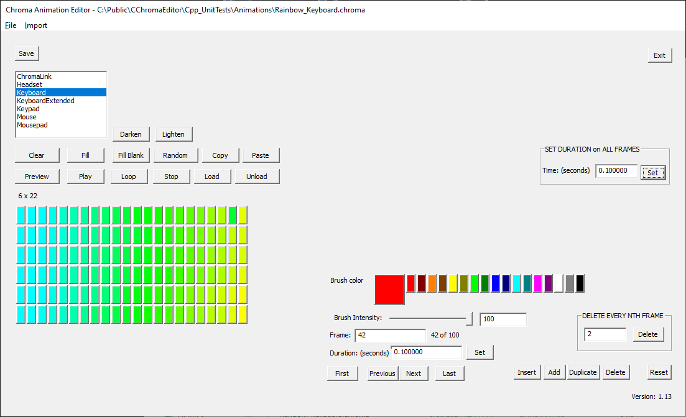

# CChromaEditor - C++ Native MFC Library for playing and editing Chroma animations

**Table of Contents**

* [Related](#related)
* [Frameworks supported](#frameworks-supported)
* [Assets](#assets)
* [API](#api)

<a name="related"></a>
## Related

- [CChromaEditor](https://github.com/RazerOfficial/CChromaEditor) - C++ Native MFC Library for playing and editing Chroma animations

- [GameMakerChromaExtension](https://github.com/RazerOfficial/GameMakerChromaExtension) - GameMaker Extension to control lighting for Razer Chroma

- [UE4ChromaSDK](https://github.com/RazerOfficial/UE4ChromaSDK) - Unreal Engine 4 (UE4) Blueprint library to control lighting for Razer Chroma

- [UnityNativeChromaSDK](https://github.com/RazerOfficial/UnityNativeChromaSDK) - Unity native library for the ChromaSDK

- [UnityChromaSDK](https://github.com/RazerOfficial/UnityChromaSDK) - Unity C# library for the Chroma Rest API

<a name="frameworks-supported"></a>
## Frameworks supported
- Windows

<a name="getting-started"></a>
## Getting Started

1 Open `CChromaEditor.sln` in Visual Studio

2 The `CChromaEditorLibrary` project builds the native C++ DLL for `x64` and `x86` platforms

3 The `CConsoleEditor` project is a console project that uses the `DLL` and provides a command-line interface. The only parameter is the file path to a `Chroma` animation file. When no parameter is provided, the editor cycles through a series of unit tests.

<a name="assets"></a>
## Assets

This library supports the `Chroma` animation exports from [UE4](https://github.com/razerofficial/UE4ChromaSDK), [Unity](https://github.com/razerofficial/UnityNativeChromaSDK/), and [GameMaker](https://github.com/razerofficial/GameMakerChromaExtension).

<a name="api"></a>
## API

The API has various methods with the `D` suffix where `double` return-type/parameters were used. This is to support engines like `GameMaker` which have a limited number of data-types.

**PluginSetLogDelegate**

Invokes the setup for a debug logging callback so that `stdout` is redirected to the callback. This is used by `Unity` so that debug messages can appear in the console window.

```C++
extern "C" EXPORT_API void PluginSetLogDelegate(DebugLogPtr fp);
```

**PluginIsInitialized**

Returns true if the plugin has been initialized. Returns false if the plugin is uninitialized.

```C++
extern "C" EXPORT_API bool PluginIsInitialized();
extern "C" EXPORT_API double PluginIsInitializedD();
```

**PluginIsDialogOpen**

The editor dialog is a non-blocking modal window, this method returns true if the modal window is open, otherwise false.

```C++
extern "C" EXPORT_API bool PluginIsDialogOpen();
extern "C" EXPORT_API double PluginIsDialogOpenD();
```

**PluginOpenEditorDialog**

Opens a `Chroma` animation file with the `.chroma` extension. Returns zero upon success. Returns -1 if there was a failure.

```C++
extern "C" EXPORT_API int PluginOpenEditorDialog(char* path);
extern "C" EXPORT_API double PluginOpenEditorDialogD(char* path);
```



**PluginOpenAnimation**

Opens a `Chroma` animation file so that it can be played. Returns an animation id >= 0 upon success. Returns -1 if there was a failure. The animation id is used in most of the API methods.

```C++
extern "C" EXPORT_API int PluginOpenAnimation(char* path);
extern "C" EXPORT_API double PluginOpenAnimationD(char* path);
```

**PluginLoadAnimation**

Loads `Chroma` effects so that the animation can be played immediately. Returns the animation id upon success. Returns -1 upon failure.

```C++
extern "C" EXPORT_API int PluginLoadAnimation(int animationId);
extern "C" EXPORT_API double PluginLoadAnimationD(double animationId);
```

**PluginUnloadAnimation**

Unloads `Chroma` effects to free up resources. Returns the animation id upon success. Returns -1 upon failure.

```C++
extern "C" EXPORT_API int PluginUnloadAnimation(int animationId);
extern "C" EXPORT_API double PluginUnloadAnimationD(double animationId);
```

**PluginPlayAnimation**

Plays the `Chroma` animation. This will load the animation, if not loaded previously. Returns the animation id upon success. Returns -1 upon failure.

```C++
extern "C" EXPORT_API int PluginPlayAnimation(int animationId);
extern "C" EXPORT_API double PluginPlayAnimationD(double animationId);
```

**PluginStopAnimation**

Stops animation playback if in progress. Returns the animation id upon success. Returns -1 upon failure.

```C++
extern "C" EXPORT_API int PluginStopAnimation(int animationId);
extern "C" EXPORT_API double PluginStopAnimationD(double animationId);
```

**PluginCloseAnimation**

Closes the `Chroma` animation to free up resources. Returns the animation id upon success. Returns -1 upon failure. This might be used while authoring effects if there was a change necessitating re-opening the animation. The animation id can no longer be used once closed.

```C++
extern "C" EXPORT_API int PluginCloseAnimation(int animationId);
extern "C" EXPORT_API double PluginCloseAnimationD(double animationId);
```

**PluginUninit**

Uninitializes the `ChromaSDK`. Returns 0 upon success. Returns -1 upon failure.

```C++
extern "C" EXPORT_API int PluginUninit();
extern "C" EXPORT_API double PluginUninitD();
```
